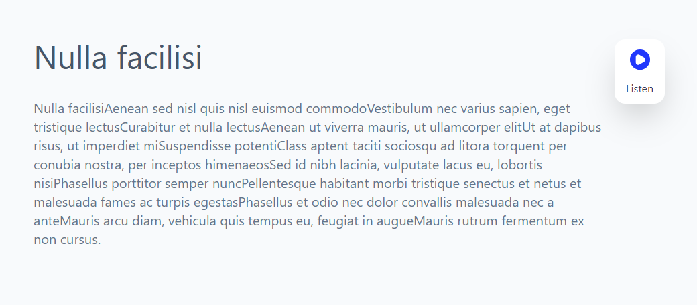

# React + SpeechSynthesis

## The Setup

- Install dependencies

```bash
   yarn install
```

- Start Development Server

```bash
yarn dev
```

- Start Development Server with Express API

```bash
yarn dev:server
```

- Run Tests

```bash
yarn test
```

- Storybook

```bash
yarn storybook
```

- Type Checking

```bash
yarn type-check
```

## API

- The code for the api is in the `api` directory. This piece is basically responsible for sending a random response from the array defined in `data.js`.
- The api returns a response in form of a JSON object containing contents. The content string is in form of a subset of SSML that is defined later here.

## APP

- The project is a basic react app, and such come with TypeScript, Vite, SpeechSynthesis, and Express.
- `ssml.ts` file in the lib folder is responsible for fetching.
- `parse.ts` file in the lib folder is responsible for parsing content into sentences.
- `speech.ts` file contains an implementation for speech engine using the local window.speechSynthesis API.
- `useSpeech.ts` reactifies the speech engine implementation and returns the controls for playback and gives information about the currently spoken word and sentence.

## Goal

- An app that calls an api to fetch SSML content and then synthesizes this content into speech and renders a sentence and word UI for the same.

- fetchContent: Fetch content from the API end point using a GET request.
- parseContentIntoSentences: Parse the fetched content into sentences.
- useSpeech: Hook that takes the current set of sentences and plays it using the speechEngine in speech.ts.
- UI: A Controls component that allows you to play, pause and fetch new content. A Currently Reading component that displays the currently read sentence and word.

## SSML

- The API returns the content in form of an SSML string. This string will contain a subset of SSML features: `<speak>`, `<p>`, `<s>`.

#### Parsing the SSML.

- Parser implementation have the same output as below.

```ts
/**
 * input: "<speak><s>This is a sentence.</s><s>This is another sentence</s></speak>",
 * sentences: ['This is a sentence.', 'This is another sentence']
 *
 * input: <speak><s>This is a sentence.</s><s>This is another sentence</s>Some more text</speak>
 * sentences: ['This is a sentence.', 'This is another sentence']
 *
 * input: <speak><s>This is a sentence.</s><s>This is another sentence</s>Some more text<s>This is a longer piece of content</s></speak>
 * sentences: ['This is a sentence.', 'This is another sentence', 'This is a longer piece of content']
 */
```

# Additional Information

- This project uses TypeScript for type safety and a better development experience.
- ESLint and Prettier are set up to maintain code quality and consistency.
- Storybook is available for interactive component development.
- Vite is used as the build tool and development server.
- Express is used for the API server during development.
- Vitest is used for testing and generating coverage reports.

### Screenshot.


